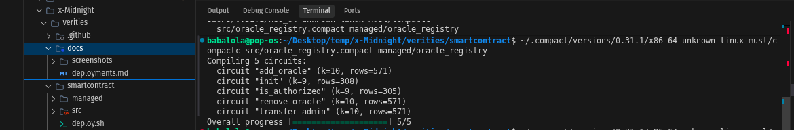
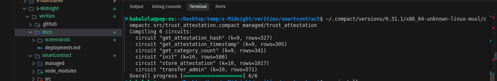
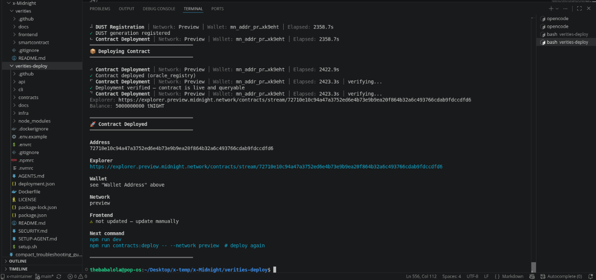
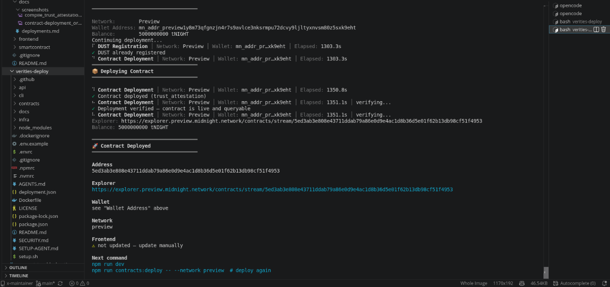

# Verities

**Programmable behavioral reputation on Midnight — prove trustworthiness without revealing data.**

[](https://midnight.network)
[](https://docs.midnight.network)
[](https://github.com/bbkenny/verities/actions)
[](LICENSE)

---

## Overview

Verities is a **privacy-first behavioral reputation layer** built natively on Midnight.

It lets users **prove patterns of trustworthiness** — loan repayment history, income consistency, delivery track records, farming seasons — **without revealing the underlying data.**

> **The Problem:** When you apply for a loan, rent an apartment, or join a marketplace, you're asked to expose everything: bank statements, salary, transaction history. The verifier needs to know *can I trust you?* — but they end up seeing *everything about you*.
>
> **Verities' Solution:** Zero-knowledge behavioral proofs. Prove "my trust score exceeds 70" without disclosing the score. Prove "I've never defaulted" without exposing a single lender. Prove "I have consistent income" without revealing your salary, employer, or payment dates.

Not identity. Not KYC. Not credentials.

**Behavioral reputation with selective disclosure.**

---

## The Core Insight

> **Midnight doesn't calculate trust. Midnight *protects* trust.**

The scoring engine (FluxID, a bank, an employer, a cooperative — *any trusted source*) **calculates** trust from behavioral data.

Midnight (Verities) **protects** that trust and lets the user control who sees what.

This is not just a privacy feature — it's a fundamentally different architecture. The attestation source is **pluggable**. Midnight's job is to shield evidence and let users selectively prove claims against it. Of course scoring can come from anywhere — Midnight doesn't calculate. It **certifies and conceals**.

---

## Architecture

```
       ANY REPUTATION SOURCE
       ─────────────────────
       Stellar (FluxID)          ┐
       Ethereum / Solana         │
       Banks / Payroll           │
       Employers                 │  All just "signals"
       GitHub / DAO history      │
       Universities              │
       Cooperatives / NGOs       │
       Insurers                  ┘
                │
                ▼
┌─────────────────────────────────────────────────┐
│         REPUTATION ATTESTATION ENGINE           │
│                                                 │
│  Computes behavioral trust from source data     │
│  Signs a structured attestation:                │
│  • Score (0-100)                                │
│  • Category (lending, income, freelance, agri)  │
│  • Input hash (SHA-256 of source data)          │
│  • Timestamp                                    │
│                                                 │
│  (This lives OUTSIDE Midnight)                  │
└──────────────────┬──────────────────────────────┘
                   │
                   ▼
┌─────────────────────────────────────────────────┐
│   MIDNIGHT CONFIDENTIAL REPUTATION LAYER        │
│                                                 │
│  Stores signed attestations PRIVATELY           │
│  User owns every disclosure                     │
│                                                 │
│  Midnight doesn't calculate trust.              │
│  Midnight PROTECTS trust.                       │
└──────────────────┬──────────────────────────────┘
                   │
                   ▼
┌─────────────────────────────────────────────────┐
│          USER-CONTROLLED DISCLOSURE             │
│                                                 │
│  "Show only this claim:"                        │
│                                                 │
│  ✓ Score > 80                                   │
│  ✓ Loan repayments: never defaulted             │
│  ✓ Income: consistent for 12 months             │
│  ✓ Deliveries: completed 120 jobs               │
│  ✓ Farming: 6 consecutive seasons               │
│  ✓ DAO contributor: active 2+ years             │
│                                                 │
│  WITHOUT revealing:                             │
│  ✗ actual transactions                          │
│  ✗ balances                                     │
│  ✗ counterparties                               │
│  ✗ history                                      │
│  ✗ identity                                     │
└──────────────────┬──────────────────────────────┘
                   │
                   ▼
┌─────────────────────────────────────────────────┐
│              VERIFICATION                       │
│                                                 │
│  Any platform / lender / protocol verifies:     │
│  • Is the proof valid?              → YES       │
│  • Is the attestation signed?       → YES       │
│  • Is the input hash verifiable?    → YES       │
│  • What is the actual score?        → HIDDEN    │
│  • Who is the user?                 → HIDDEN    │
│  • What are the transactions?       → HIDDEN    │
└─────────────────────────────────────────────────┘
```

---

## Why Midnight — The "Impossible Elsewhere" Test

Every feature must answer: *"Why can't this exist on Ethereum, Solana, or a regular database?"*

| Claim | Why It Requires Midnight |
|---|---|
| "I've repaid 17 loans" | On a public chain, this exposes every lender, amount, and date. On Midnight, ZK proofs verify the pattern without revealing any transaction. |
| "I receive stable monthly income" | On a public chain, everyone sees your salary, employer's wallet, and spending. On Midnight, you prove the pattern without exposing a single payment. |
| "My business processed over $50,000" | On a public chain, competitors see revenue, clients, and margins. On Midnight, you prove scale without exposing operations. |
| "I've farmed for 6 consecutive seasons" | On a public chain, buyers, prices, and volumes are visible. On Midnight, the track record is verified without revealing commercial relationships. |

**Every single claim involves behavioral data that is sensitive and must remain private.** That's not identity — identity is static. This is *dynamic behavioral proof*. Midnight's selective disclosure is the only architecture that makes this work without a trusted intermediary.

---

## Public State vs Private Witness

This is the foundational concept of Compact development. Verities is designed around this principle deliberately.

### Public Ledger State

Data stored in `export ledger` is **visible to all network participants** on the public blockchain.

In Verities, only the following is public (across both contracts):
- `admin` — the contract administrator address
- `oracle_count` / `oracles` — a self-contained on-chain whitelist of authorized attestation providers (membership map)
- `attestation_count` — total number of attestations stored (a counter)
- `attestation_hashes` — SHA-256 commitment of the scoring inputs, keyed by `(wallet, category)`
- `attestation_timestamps` — when each attestation was issued, keyed by `(wallet, category)`
- `category_count` — how many *distinct* categories a wallet holds (a count, not which ones)

None of this reveals scores, behavioral history, wallet balances, or counterparties.

### Private Witness

Data supplied via `witness` functions is **off-chain private input** — it exists only inside the ZK circuit computation and **never touches the public ledger**.

In Verities, the following is private:
- `private_score()` — the actual behavioral score (0-100). Supplied by the prover as a private witness. Used *only* for comparison against a threshold in `verify_claim()`. Never stored, never disclosed.
- `caller_address()` — the caller's identity. Used for admin/oracle authorization. Not stored in public state.

### The `disclose()` Gate

In Compact, any value that originates from a witness (private input) is considered **witness-tainted**. You cannot move a witness-tainted value to the public ledger without explicitly calling `disclose()`.

```compact
// Writing the oracle_address to the whitelist — DELIBERATE disclosure
oracles.insert(disclose(oracle_address), true);

// This comparison stays PRIVATE — score never enters the ledger
const score = private_score();   // private witness
const result = score > threshold; // private computation
return disclose(result);          // only the boolean is disclosed
```

**Every `disclose()` call in Verities is intentional and documented in the contract source.**

---

## Smart Contract Reference

### Contract 1: `oracle_registry.compact`

A standalone, self-contained whitelist of authorized attestation providers.

| Function | Visibility | Parameters | Returns | Description |
|---|---|---|---|---|
| `init` | `export circuit` | `new_admin: Bytes<32>` | `[]` | Initialize registry with first admin. One-time only. |
| `add_oracle` | `export circuit` | `oracle_address: Bytes<32>` | `[]` | Add an oracle to the whitelist. Admin only (private witness). |
| `remove_oracle` | `export circuit` | `oracle_address: Bytes<32>` | `[]` | **Revoke** an oracle via `Map.remove()` — the key is deleted, so `is_authorized()` becomes false. Admin only. |
| `is_authorized` | `export circuit` | `oracle_address: Bytes<32>` | `Boolean` | Membership check against the whitelist. |
| `transfer_admin` | `export circuit` | `new_admin: Bytes<32>` | `[]` | Transfer admin to a new address. Admin only. |

**Public ledger:** `admin`, `oracle_count`, `oracles` (Map), `initialized`

**Private witnesses:** `caller_address()` — admin identity for authorization

### Contract 2: `trust_attestation.compact`

The core ZK primitive of Verities. Stores attestations and enables selective disclosure proofs.

| Function | Visibility | Parameters | Returns | Description |
|---|---|---|---|---|
| `init` | `export circuit` | `new_admin: Bytes<32>` | `[]` | Initialize with first admin. One-time only. |
| `add_oracle` | `export circuit` | `oracle_address: Bytes<32>` | `[]` | Add an oracle to the contract's own whitelist. Admin only. |
| `remove_oracle` | `export circuit` | `oracle_address: Bytes<32>` | `[]` | Revoke an oracle via `Map.remove()`. Admin only. |
| `is_authorized` | `export circuit` | `oracle_address: Bytes<32>` | `Boolean` | Membership check against the contract's whitelist. |
| `store_attestation` | `export circuit` | `wallet: Bytes<32>`, `category: Bytes<16>`, `input_hash: Bytes<32>`, `timestamp: Uint<64>` | `[]` | **Oracle-only.** Stores the SHA-256 commitment (never the score) keyed by `(wallet, category)`. Rejects non-whitelisted callers. |
| `verify_claim` | `export circuit` | `wallet: Bytes<32>`, `category: Bytes<16>`, `threshold: Uint<8>` | `Boolean` | **Core ZK proof.** Requires an existing attestation, then returns YES/NO for `score > threshold`. Score stays private. |
| `get_attestation_hash` | `export circuit` | `wallet: Bytes<32>`, `category: Bytes<16>` | `Bytes<32>` | Returns the input hash for independent oracle verification. |
| `get_attestation_timestamp` | `export circuit` | `wallet: Bytes<32>`, `category: Bytes<16>` | `Uint<64>` | Returns timestamp of the last attestation for that pair. |
| `get_category_count` | `export circuit` | `wallet: Bytes<32>` | `Uint<8>` | Returns how many *distinct* categories a wallet holds. |
| `transfer_admin` | `export circuit` | `new_admin: Bytes<32>` | `[]` | Transfer admin. Admin only. |

**Public ledger:** `admin`, `initialized`, `oracle_count`, `oracles`, `attestation_count`, `attestation_hashes` (struct-keyed), `attestation_timestamps` (struct-keyed), `category_count`

**Private witnesses:** `caller_address()`, `private_score()` — **score never touches the ledger**

> **Note on cross-contract calls.** The original design linked `trust_attestation` to `oracle_registry` via a cross-contract `is_authorized()` check. Compact `v0.23` / `compactc v0.31.1` does not yet implement contract types (cross-contract calls), so `trust_attestation` maintains its **own** whitelist instead. `oracle_registry.compact` remains as a standalone, reference whitelist contract. See **Security notes** below.

---

## Security notes

Documented honestly, because the trust model matters:

- **Cross-contract calls are not yet supported.** Compact `v0.23` / `compactc
  v0.31.1` does not implement contract types (verified against the compiler
  binary: "contract types are not yet implemented"). The original two-contract
  design — where `trust_attestation` calls `oracle_registry.is_authorized()` —
  cannot compile yet, so `trust_attestation` keeps its **own** oracle whitelist
  and `oracle_registry.compact` ships as a standalone reference contract.

- **Removal is real.** `remove_oracle()` uses `Map.remove()`, which deletes the
  key. A removed oracle immediately fails `is_authorized()` (a `Map.member()`
  check). The earlier `Map.insert(addr, false)` pattern was a bypass because the
  key remained present.

- **The score witness is not yet cryptographically bound to the stored
  commitment.** Compact `v0.23` exposes no in-circuit hash or signature
  primitive, so `verify_claim()` cannot recompute `hash(score)` and compare it
  against `attestation_hashes` inside the circuit. It *does* require an
  attestation to exist for the `(wallet, category)` pair, which stops "claims
  without an attestation". Fully binding the score to the oracle's SHA-256
  commitment requires a hash/signature built-in and is tracked as a post-MVP
  hardening item.

---

## Initial Product Idea

Verities is a programmable behavioral reputation layer built on Midnight that enables users to prove trustworthiness without exposing behavioral data. Trusted reputation providers (oracles) — which can be financial institutions, cooperatives, on-chain protocols like FluxID, or any data source — compute behavioral scores from source data and issue signed attestations. Users privately store these attestations on Midnight and selectively disclose only the claims required by a specific application. A lending protocol asks "does this borrower meet our threshold?" — the user proves YES or NO without revealing their score, their history, or their identity. Developers integrate a single verification API instead of rebuilding trust infrastructure from scratch. The attestation source is pluggable by design; Midnight's role is not to calculate trust, but to protect and prove it.

---

## Tech Stack

| Layer | Technology |
|---|---|
| Blockchain | Midnight Network (Preprod / Preview) |
| Smart Contract Language | Compact (ZK circuit compilation) |
| Privacy Mechanism | Zero-knowledge proofs via Compact's witness model |
| Runtime | Midnight SDK (`@midnight-ntwrk/*`) |
| Test Framework | Vitest (TypeScript) |
| CI/CD | GitHub Actions |
| Node Runtime | Node.js 22 |

---

## Local Setup

### Prerequisites

| Requirement | Version | Install |
|---|---|---|
| Node.js | 22+ | [nodejs.org](https://nodejs.org) |
| Docker | Latest | [docker.com](https://docker.com) |
| Compact compiler | Latest | See below |
| Midnight proof server | Latest | See below |

### 1. Install the Midnight Toolchain

Follow the official Midnight installation guide:
```bash
# Install the Compact compiler (the `compact` CLI is a version manager; it
# downloads the `compactc` compiler binary to ~/.compact/versions/<ver>/).
npm install -g @midnight-ntwrk/compact-compiler

# Verify installation
compact --version
```

> The `npm run compile` / `make compile` scripts invoke `compactc` directly
> (`compactc <source.compact> <target-dir>`). If `compactc` is not on your
> `PATH`, it lives at `~/.compact/versions/0.31.1/x86_64-unknown-linux-musl/compactc`
> (see `compact_troubleshooting_guide.md` in the parent workspace for the full
> toolchain install story).

### 2. Start the Proof Server (Docker)

```bash
docker run -p 6300:6300 midnightntwrk/proof-server:latest
```

### 3. Clone the Repository

```bash
git clone https://github.com/bbkenny/verities.git
cd verities
```

### 4. Install Dependencies

```bash
cd smartcontract
npm install
```

### 5. Compile the Contracts

```bash
# Compile both contracts (generates ZK circuits in managed/)
npm run compile

# Or use make
make compile
```

Successful output will list:
```
⚙️  Compiling oracle_registry.compact...
oracle_registry: 5 circuits (init, add_oracle, remove_oracle, is_authorized, transfer_admin)
⚙️  Compiling trust_attestation.compact...
trust_attestation: 10 circuits (init, add_oracle, remove_oracle, is_authorized,
  store_attestation, verify_claim, get_attestation_hash, get_attestation_timestamp,
  get_category_count, transfer_admin)
✅ Compilation complete. Circuits in managed/
```

### 6. Run Tests

```bash
npm test
```

### 7. Deploy to Preprod

```bash
bash deploy.sh preprod
```

---

## Contract Compilation

### Compile

```bash
cd smartcontract
npm run compile
```

### Expected Output

After successful compilation, the `managed/` directory will contain 15 circuits
(5 in `oracle_registry`, 10 in `trust_attestation`), each with a `.zkir`
intermediate representation plus `.prover`/`.verifier` proving keys:

```
managed/
├── oracle_registry/            # 5 circuits
│   ├── compiler/contract-info.json
│   ├── contract/index.js + index.d.ts     # generated TS bindings
│   ├── zkir/*.zkir                        # ZK intermediate representation
│   └── keys/*.prover + *.verifier         # proving/verifying keys
└── trust_attestation/          # 10 circuits (incl. verify_claim)
    ├── compiler/contract-info.json
    ├── contract/index.js + index.d.ts
    ├── zkir/*.zkir
    └── keys/*.prover + *.verifier
```

---

## Deployment

### Deployed Contracts

**Midnight Preprod (Level 2):**

| Contract | Network | Address |
|---|---|---|
| oracle_registry | Midnight Preprod | [`166dc24b…0cbe4`](https://explorer.preprod.midnight.network/contracts/stream/166dc24bf58a14b8183e231ddfd6a5579528bd6e8860832d2fcb4a730020cbe4) |
| trust_attestation | Midnight Preprod | [`6f61012d…8b9a75`](https://explorer.preprod.midnight.network/contracts/stream/6f61012d8a550cd813f96e5ddec88c858b906e90f8deeee909ebd05e1a8b9a75) |

**Midnight Preview (Level 1):**

| Contract | Network | Address |
|---|---|---|
| oracle_registry | Midnight Preview | [`72710e10…ccdfd6`](https://explorer.preview.midnight.network/contracts/stream/72710e10c94a47a3752ed6e4b73e9b9ea20f864b32a6c493766cdab9fdccdfd6) |
| trust_attestation | Midnight Preview | [`5ed3ab3e…1f4953`](https://explorer.preview.midnight.network/contracts/stream/5ed3ab3e808e43711ddab79a86e0d9e4ac1d8b36d5e01f62b13db98cf51f4953) |

> Full addresses and timestamps are in [`docs/deployments.md`](docs/deployments.md).
> Compile + deployment screenshots are in [`docs/screenshots/`](docs/screenshots/).

---

## Running Tests

```bash
cd smartcontract
npm test
```

### Test Coverage

| Test Suite | Tests | What It Covers |
|---|---|---|
| `oracle_registry.test.ts` | 19 tests | compiled-artifact interface check, init, add/remove oracle (with true `Map.remove()` revocation), auth checks, unauthorized rejection, ownership transfer |
| `trust_attestation.test.ts` | 23 tests | compiled-artifact interface check, init, whitelist-gated attestation storage, score-never-stored property, verify_claim YES/NO + existence gate, distinct-category counting, multi-user independence, hash queryability |

**Critical tests:**
- `CRITICAL: score is never stored in public state` — the score never appears in public ledger state.
- `CRITICAL: non-whitelisted caller cannot store an attestation` — the oracle gate is enforced (no tautology).
- `CRITICAL: a removed oracle can no longer store attestations` — `Map.remove()` revocation is real.
- `CRITICAL: rejects claims without a stored attestation` — `verify_claim()` is gated on attestation existence.

Each suite also reads `managed/<contract>/compiler/contract-info.json` and asserts
the compiled circuit list, ledger fields, and witnesses match, so the tests stay
bound to the actual compiled artifacts rather than drifting from the source.

---

## Why This Scales — Integration Examples

The first customer isn't a person. It's another application.

| Integration | What They Ask | What They DON'T See |
|---|---|---|
| 🏦 **Lending** | "Is this borrower trustworthy?" | Lender history, amounts, dates, counterparties |
| 💼 **Payroll** | "Has this employee been consistently paid?" | Salary, employer identity, payment dates |
| 🛒 **Marketplace** | "Is this seller reliable?" | Order history, revenue, customer list |
| 🌾 **Insurance** | "Has this farmer harvested for 5 seasons?" | Crop revenue, buyers, volumes |
| 🏥 **Healthcare** | "Is this provider licensed?" | Full employment history, records |
| 🤖 **AI Agents** | "Is this wallet trustworthy for a $10K tx?" | Everything — just YES/NO |

Every row is a separate product that could be built on Verities' `verify_claim()` API.

---

## Roadmap — Lunar Levels

| Level | Name | Goal |
|---|---|---|
| 🌑 **Level 1** | New Moon | ✅ Toolchain set up, contracts compiled, deployed to Preview. |
| 🌒 **Level 2** | Waxing Crescent | Frontend wallet connection (Lace), live `verify_claim()` circuit call with observable privacy — this submission. |
| 🌓 **Level 3** | First Quarter | Idea submission + oracle demo with FluxID as example provider. Live `verify_claim()` demo. |
| 🌔 **Level 4** | Waxing Gibbous | Production UI with 7 states per screen. Multiple claim categories. Verifier dashboard. |
| 🌕 **Level 5** | Full Moon | Full MVP: multi-oracle support, real behavioral data, verifier API endpoint. |
| 🌝 **Level 6** | Supermoon | Ecosystem integration, real user traction, FluxID → Verities pipeline live. |

---

## Project Structure

```
verities/
├── .github/
│   └── workflows/
│       └── ci.yml                     # CI: compile → test → verify managed/
├── smartcontract/
│   ├── src/
│   │   ├── oracle_registry.compact    # Contract 1: oracle whitelist
│   │   ├── trust_attestation.compact  # Contract 2: ZK reputation proofs
│   │   ├── oracle_registry.test.ts    # Test suite 1
│   │   └── trust_attestation.test.ts  # Test suite 2
│   ├── managed/                       # Generated: ZK circuits + keys (after compile)
│   ├── package.json
│   ├── tsconfig.json
│   ├── vitest.config.ts
│   ├── Makefile
│   └── deploy.sh
├── docs/
│   ├── screenshots/                   # Compile + deploy screenshots
│   └── deployments.md                 # Deployment log
├── .gitignore
└── README.md
```

---

## The Narrative

> *"Identity proves who you are. Reputation proves why you should be trusted. Midnight finally lets users prove reputation without exposing their private data."*

> *"FluxID proved that behavior reveals trust. Verities proves that you can verify trust without revealing behavior. That's only possible on Midnight."*

---

## Built by the Creators of FluxID

Verities is built by the same team behind **[FluxID](https://github.com/bbkenny/FluxID)** — the behavioral reputation engine on Stellar that turns any wallet into a real-time financial identity.

FluxID is where behavioral trust is *calculated*.  
Verities is where behavioral trust is *protected and proved*.

Together, they form a full trust infrastructure stack:

```
FluxID (Stellar)                    Verities (Midnight)
─────────────────         ──────────────────────────────────
Computes behavioral   →   Protects and certifies trust
trust scores              via zero-knowledge proofs
"How trustworthy?"        "Prove trust without revealing it"
```

---

## Screenshots

### 🌑 Level 1 — New Moon Submission

- **GitHub Repository:** [https://github.com/bbkenny/verities](https://github.com/bbkenny/verities)
- **Contract Addresses (Midnight Preview):**
  - `oracle_registry` → `72710e10c94a47a3752ed6e4b73e9b9ea20f864b32a6c493766cdab9fdccdfd6`
  - `trust_attestation` → `5ed3ab3e808e43711ddab79a86e0d9e4ac1d8b36d5e01f62b13db98cf51f4953`
- **Compiler:** `compactc v0.31.1` · Language: `v0.23.0` · Platform: `x86_64 Linux`
- **Circuits Generated:** 15 total (5 oracle_registry + 10 trust_attestation)

### 🟣 Level 1 Requirements Map

Each requirement mapped to the exact file, link, or screenshot that satisfies it.

| Requirement | Status | Proof |
|---|---|---|
| Toolchain installed (Compact compiler, Node 22, Docker) | ✅ | `compactc v0.31.1` at `~/.compact/versions/0.31.1/` · Node `v22.18.0` — see [Setup section](#local-setup) |
| Contract compiles via `compact compile` | ✅ | Both contracts compiled cleanly — 15 ZK circuits generated — screenshot below |
| Passing test suite | ✅ | 42 tests across [`smartcontract/src/`](https://github.com/bbkenny/verities/tree/master/smartcontract/src) — run `npm test` |
| Generated `managed/` directory (circuits + keys) | ✅ | [`smartcontract/managed/`](https://github.com/bbkenny/verities/tree/master/smartcontract/managed) — prover + verifier keys for all 15 circuits |
| Contract deployed to Preview or Preprod | ✅ | Both deployed to **Midnight Preview** — `oracle_registry` `72710e10…ccdfd6`, `trust_attestation` `5ed3ab3e…1f4953` (see [`docs/deployments.md`](docs/deployments.md) + screenshots below) |
| Initial product idea paragraph in README | ✅ | [Overview section](#overview) — behavioral reputation layer with ZK selective disclosure |
| Minimum 5 meaningful commits | ✅ | [17+ commits](https://github.com/bbkenny/verities/commits/master) — scaffold → contracts → tests → CI → compile → screenshots → deploy |

### 📂 Level 1 — Code Proofs (For Reviewer)

The canonical source is in `smartcontract/src/`. Key excerpts below.

**1. Oracle Registry — revocation via `Map.remove()`**
*File: `smartcontract/src/oracle_registry.compact`*

```compact
export circuit remove_oracle(oracle_address: Bytes<32>): [] {
    const caller = caller_address();
    assert(caller == admin, "Unauthorized: caller is not admin");
    oracles.remove(disclose(oracle_address));   // deletes the key
    oracle_count.decrement(1);
}

export circuit is_authorized(oracle_address: Bytes<32>): Boolean {
    return oracles.member(disclose(oracle_address));   // key presence
}
```

**2. Trust Attestation — struct-keyed attestations + real oracle gate**
*File: `smartcontract/src/trust_attestation.compact`*

```compact
struct WalletCategory {
    subject: Bytes<32>;
    category: Bytes<16>;
}

export circuit store_attestation(
    wallet: Bytes<32>,
    category: Bytes<16>,
    input_hash: Bytes<32>,
    timestamp: Uint<64>
): [] {
    const caller = caller_address();
    assert(is_authorized(caller), "Unauthorized: caller is not an authorized oracle");

    const key = WalletCategory { subject: wallet, category: category };
    attestation_hashes.insert(disclose(key), disclose(input_hash));
    attestation_timestamps.insert(disclose(key), disclose(timestamp));
    attestation_count.increment(1);
}

export circuit verify_claim(
    wallet: Bytes<32>,
    category: Bytes<16>,
    threshold: Uint<8>
): Boolean {
    const key = WalletCategory { subject: wallet, category: category };
    assert(attestation_hashes.member(disclose(key)), "No attestation for wallet/category");
    const score = private_score();
    return disclose(score > threshold);   // only the boolean is revealed
}
```

### Level 1 Screenshots

**Oracle Registry — 5/5 circuits compiled**


**Trust Attestation — 10/10 circuits compiled**


**oracle_registry — deployed on Midnight Preview**


**trust_attestation — deployed on Midnight Preview**


---

## 🌒 Level 2 — Waxing Crescent Submission

The first thread of light: the contract is wired to a real frontend, the Lace
wallet connects, and a circuit is called live — proving something **without
showing it**.

### Live demo

- **Live URL:** https://use-verities.vercel.app/
- **Repo:** https://github.com/bbkenny/verities

### The observable privacy claim

Verities' flagship circuit `verify_claim()` proves a claim **without revealing
the underlying data**:

```compact
export circuit verify_claim(wallet, category, threshold): Boolean {
    assert(attestation_hashes.member(...), "No attestation");
    const score = private_score();        // private witness — never on-chain
    return disclose(score > threshold);   // ONLY the boolean is revealed
}
```

- **Revealed:** a single `YES`/`NO` ("my trust score exceeds 70").
- **Concealed:** the actual score, all behavioral data, the wallet, the counterparties.

In the UI, a user connects Lace, picks a threshold, and receives `Verified ✓`
or `Not verified ✗` — the score `83` never appears on-chain or in the result.

### Level 2 requirements map

| Requirement | Status |
|---|---|
| Lace wallet connect / disconnect | ✅ `frontend/src/services/midnight/wallet.ts` (DApp connector API 4.x) |
| Circuit called from the frontend | ✅ `verify_claim()` invoked via the browser providers |
| Observable privacy behavior | ✅ boolean disclosed, score kept private (above) |
| Contract deployed to Preprod | ✅ | Both deployed to **Midnight Preprod** — `oracle_registry` `166dc24b…0cbe4`, `trust_attestation` `6f61012d…8b9a75` (see [`docs/deployments.md`](docs/deployments.md)) |
| Minimum 8 meaningful commits | ✅ 18+ |

### Architecture

```
Lace extension (window.midnight, DApp connector 4.x)
        │ connect(networkId)
        ▼
WalletProvider (balanceTx / submitTx via wallet)
        │
        ▼
initializeProviders()  ── FetchZkConfigProvider  (zkir + verifier keys over HTTP)
                      ── httpClientProofProvider (proof server from wallet config)
                      ── indexerPublicDataProvider
                      ── in-memory private state provider (browser)
        │
        ▼
VeritiesAPI.join(address) ──▶ callTx.verify_claim(wallet, category, threshold)
        │
        ▼
YES / NO  (score never disclosed)
```

---

## License

MIT — see [LICENSE](LICENSE)

---

*Verities — Fundamental truths, privately proved. 🌙*
